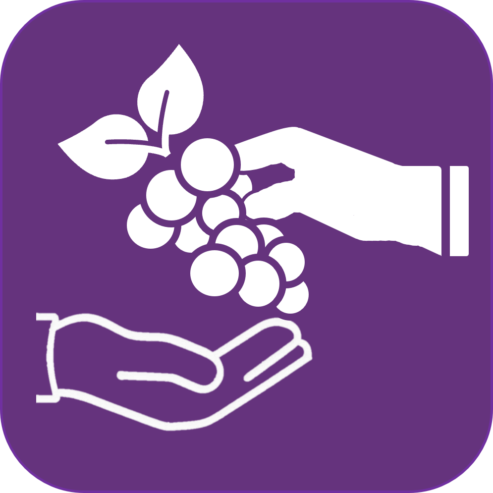

# NutriPlato

## Una aplicación integral para la nutrición y bienestar basada en el Plato del Bien Comer mexicano

NutriPlato es una aplicación móvil diseñada para ayudar a los mexicanos a mejorar sus hábitos alimenticios y su calidad de vida, siguiendo las recomendaciones oficiales de la Secretaría de Salud de México y la Norma Oficial Mexicana NOM-043-SSA2-2012.

## 🌮 Descripción

NutriPlato nace como respuesta a los crecientes problemas de salud relacionados con la alimentación en México. Nuestra aplicación transforma el "Plato del Bien Comer" en una herramienta digital interactiva que facilita la comprensión y aplicación de los principios de una alimentación balanceada adaptada a la cultura alimentaria mexicana.

## 🥑 Características principales

### 🍎 Plato del Bien Comer Interactivo
- Visualización interactiva del Plato del Bien Comer oficial mexicano
- Distribución adecuada de porciones según las recomendaciones de la COFEPRIS y la Secretaría de Salud
- Información detallada de cada grupo alimenticio con ejemplos locales

### 📊 Seguimiento Nutricional
- Registro diario de alimentos por tipo de comida (desayuno, almuerzo, cena, snack)
- Cálculo automático de calorías y macronutrientes
- Visualización gráfica de progreso hacia metas nutricionales
- Análisis detallado de la distribución de macronutrientes

### 🔍 Buscador de Alimentos
- Amplia base de datos de alimentos comunes en la dieta mexicana
- Información nutricional detallada respaldada por el Sistema Mexicano de Equivalencias
- Filtros por categorías y propiedades nutricionales
- Sugerencias de alimentos complementarios

### 💪 Rutinas de Ejercicio
- Programas de actividad física adaptados a diferentes niveles
- Ejercicios que pueden realizarse en casa sin equipo especializado
- Recomendaciones basadas en los lineamientos de la CONADE
- Seguimiento de progreso y recordatorios

### 📰 Artículos Educativos
- Contenido revisado por especialistas en nutrición
- Información basada en investigaciones de instituciones como UNAM, CONACYT e IMSS
- Consejos prácticos adaptados a la realidad mexicana
- Mitos y verdades sobre alimentación y ejercicio

## 🌵 Beneficios para la salud

NutriPlato ayuda a los usuarios a:

- **Prevenir enfermedades crónicas**: México enfrenta altas tasas de diabetes, hipertensión y obesidad. Una alimentación adecuada puede reducir hasta un 80% el riesgo de estas enfermedades.
- **Mejorar el bienestar físico y mental**: Una dieta balanceada influye positivamente en el estado de ánimo y la salud mental, como lo confirman estudios respaldados por el CONACYT.
- **Optimizar el rendimiento deportivo**: Recomendaciones específicas para quienes practican actividad física regular, aprovechando los superalimentos mexicanos como amaranto, chía y nopales.
- **Promover tradiciones alimentarias saludables**: Valorización de la dieta tradicional mexicana, reconocida por la UNESCO como Patrimonio Cultural Inmaterial de la Humanidad.

## 🚀 Próximas funcionalidades

Estamos trabajando continuamente en mejorar NutriPlato con nuevas características:

- **Planes de alimentación personalizados** adaptados a diferentes objetivos: pérdida de peso, ganancia muscular, salud general, etc.
- **Reconocimiento de alimentos por imagen** para facilitar el registro de comidas
- **Comunidad de usuarios** para compartir recetas y experiencias
- **Integración con profesionales de la salud** para consultas y seguimiento remoto
- **Sincronización con dispositivos de actividad física** para un análisis más completo
- **Versión familiar** con funcionalidades específicas para niños y adolescentes

## 🔒 Compromiso con tu privacidad

NutriPlato se compromete a proteger tus datos personales de acuerdo con la Ley Federal de Protección de Datos Personales en Posesión de los Particulares. La información de salud que compartes con nuestra aplicación es confidencial y nunca será vendida a terceros.

## ⚠️ Aviso importante

NutriPlato es una herramienta informativa y educativa, no sustituye la consulta con profesionales de la salud. Siempre recomendamos consultar a un nutriólogo, médico o especialista antes de iniciar cualquier régimen alimenticio o programa de ejercicios.

## 🔧 Para desarrolladores

NutriPlato está desarrollado con Flutter, lo que permite una experiencia consistente en ambas plataformas móviles. Si deseas contribuir al proyecto:

1. Clona el repositorio
2. Instala las dependencias con `flutter pub get`
3. Ejecuta la aplicación con `flutter run`

### Estructura del proyecto

- data: Bases de datos de alimentos y contenido informativo
- infrastructure: Lógica de negocio y gestión del estado
- presentation: Interfaces de usuario y componentes visuales
- fitness: Módulos relacionados con ejercicio y actividad física

---

*NutriPlato: Alimentación inteligente para una vida saludable, ¡al estilo mexicano!*